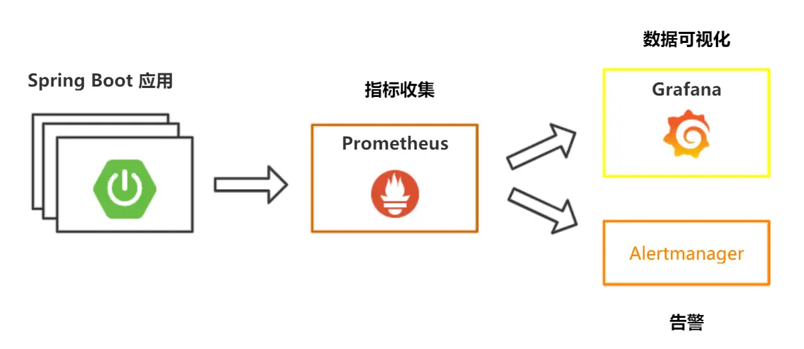

# springboot-actuator-prometheus-grafana

## 前言

本文主要介绍:

- Spring Boot Actuator 模块 详解：健康检查，度量，指标收集和监控中，我们学习了 Spring Boot Actuator 模块的作用、配置和重要端点的介绍
- 如何集成监控告警系统Prometheus 和图形化界面Grafana，如何自定义监控指标，做应用监控埋点，Prometheus 如何集成 Alertmanager 进行告警




## 理论部分

1. 什么是SpringBootActuator

Spring Boot Actuator 模块提供了生产级别的功能，比如健康检查，审计，指标收集，HTTP
跟踪等，帮助我们监控和管理SpringBoot应用。这个模块是一个采集应用内部信息暴露给外部的模块，上述的功能都可以通过HTTP
和JMX 访问。

因为暴露内部信息的特性，Actuator 也可以和一些外部的应用监控系统整合（Prometheus,
Graphite, DataDog, Influx, Wavefront,
NewRelic等）。这些监控系统提供了出色的仪表板，图形，分析和警报，可帮助你通过一个统一友好的界面，监视和管理你的应用程序。

2. Endpoints

Spring Boot 提供了所谓的 endpoints （下文翻译为端点）给外部来与应用程序进行访问和交互。

每一个端点都可以通过配置来单独禁用或者启动，可参考[application.properties](src/main/resources/application.properties)

不同于Actuator 1.x，Actuator 2.x 的大多数端点默认被禁掉。 Actuator 2.x 中的默认端点增加了/actuator前缀。  
默认暴露的两个端点为/actuator/health和 /actuator/info

重要的端点：

- [/health](http://localhost:8080/actuator/health) 端点

提供了关于应用健康情况的一些基础信息,很多自动配置的健康指示器：如redis、rabbitmq、db等组件。当你的项目有依赖对应组件的时候，这些健康指示器就会被自动装配，继而采集对应的信息。

比如启用redis

```properties
# false 所有自动配置的健康指示器
management.health.defaults.enabled=true

management.health.redis.enabled=true
```

也可以自定义Health Indicator,比如[CustomHealthIndicator.java](src/main/java/org/spring/boot/core/health/CustomHealthIndicator.java)


- [metrics](http://localhost:8080/actuator/metrics/{MetricName})端点

该端点提供了一些有用的应用程序指标（JVM 内存使用、系统CPU使用等）信息

- [loggers](http://localhost:8080/actuator/loggers)

端点暴露了我们程序内部配置的所有logger的信息,现在访问 [root logger](http://localhost:8080/actuator/loggers/root)

改变运行时的日志等级，/loggers端点我最想提的就是这个功能，能够动态修改你的日志等级，如果在生产环境中，你想要你的应用输出一些Debug信息以便于你诊断一些异常情况，你你只需要按照上述方式就可以修改，而不需要重启应用

比如，我们可以通过下述方式来修改 root logger的日志等级。我们只需要发起一个URL 为http://localhost:8080/actuator/loggers/root的POST请求，POST报文如下：

``` json
{
   "configuredLevel": "DEBUG"
}
```

- [info](http://localhost:8080/actuator/info)端点

/info端点可以用来展示你程序的信息。我理解过来就是一些程序的基础信息。并且你可以按照自己的需求在配置文件application.properties中个性化配置（默认情况下，该端点只会返回一个空的json内容。）：


- [beans](http://localhost:8080/actuator/beans)端点
/beans端点会返回Spring 容器中所有bean的别名、类型、是否单例、依赖等信息


- [heapdump](http://localhost:8080/actuator/heapdump) 端点

会自动生成一个 Jvm 的堆文件 heapdump。我们可以使用 JDK 自带的 Jvm 监控工具 VisualVM 打开此文件查看内存快照。

- [threaddump](http://localhost:8080/actuator/threaddump) 端点

这个端点我个人觉得特别有用，方便我们在日常定位问题的时候查看线程的情况。 主要展示了线程名、线程ID、线程的状态、是否等待锁资源、线程堆栈等信息。就是可能查看起来不太直观。


- [shutdown](http://localhost:8080/actuator/shutdown)端点


这些 Actuator 模块本来就有的端点我们称之为原生端点。根据端点的作用的话，我们大概可以分为三大类：

- 应用配置类：获取应用程序中加载的应用配置、环境变量、自动化配置报告等与Spring Boot应用密切相关的配置类信息。

- 度量指标类：获取应用程序运行过程中用于监控的度量指标，比如：内存信息、线程池信息、HTTP请求统计等。

- 操作控制类：提供了对应用的关闭等操作类功能。


## 原理分析

Actuator使用Micrometer与外部应用程序监控系统集成

Micrometer 为 Java 平台上的性能数据收集提供了一个通用的 API，应用程序只需要使用
Micrometer 的通用 API 来收集性能指标即可。Micrometer会负责完成与不同监控系统的适配工作。这就使得切换监控系统变得很容易。 对比 Slf4j 之于
Java Logger 中的定位。


## 使用场景


## 总结


## References

- [Spring Boot Actuator 模块 详解：健康检查，度量，指标收集和监控](https://ricstudio.top/archives/spring_boot_actuator_learn)

- [Spring Boot Actuator: Production-ready Features](https://docs.spring.io/spring-boot/docs/current/reference/html/actuator.html#actuator)

- [Spring Boot 微服务应用集成Prometheus + Grafana 实现监控告警](https://segmentfault.com/a/1190000021639286)
